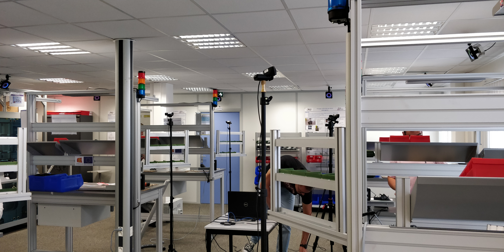

# Main page of dataset of person flows during an assembly phase in an industrial site with an UWB system and a motion capture system in NLOS done by [CESI](https://www.cesi.fr/), [ESIGELEC](https://www.esigelec.fr/) and [SIATECH](https://www.siatech.fr/)

## Paper :
Mickael Delamare13, Fabrice Duval2, Remi Boutteau3.  

 
1[siatech](https://www.siatech.fr/) , IRSEEM, Rouen, France, Normandie Univ, UNIROUEN,mickael.delamare@siatech.fr   
2[cesi](http://www.cesi.fr.),   Normandie Univ, UNIROUEN, CESI, LINEAC, 76000 ROUEN, France, fduval@cesi.fr   
3[ESIGELEC](http://www.esigelec.fr/) , IRSEEM, Rouen, France, Normandie Univ, UNIROUEN, boutteau@esigelec.fr

## Datasets :

Dataset of each position of person'Rig.

The dataset is compose of two '.zip' : 

Filtered_datas_UWB.zip : 

Raw_datas_UWB_Mocap.zip : 

dataset availables soon

## Abstract :

Improving performance and safety conditions at industrial sites remains key elements of the Group's strategy.
Major issues and specifically require the ability to dynamically locate people and assets on the site. Currently, the security and regulation of access to areas with different characteristics (types of tasks, level of risk or confidentiality...) are often carried out with badge doors or barriers. These means present several weaknesses in the face of inappropriate movements of people, but also of objects or tools. Also, there is an increasing use of technological devices requiring precise localization in the industrial environment such as AGVs (mobile robots or drones) or augmented reality devices.
It is therefore becoming essential to have tools to dynamically manage these flows of people or goods associated with precise location technologies. An Ultra-Wide-Band solution will be employed to quickly and efficiently identify persons who may find themselves in unauthorized areas or perform tasks for which they are uninstructed.
Besides to dynamic people tracking, this solution can overcome problems of moving objects and tools in the production workshops. We propose a new algorithm to have information about the displacement of workers and evaluate performance and safety of workers.
